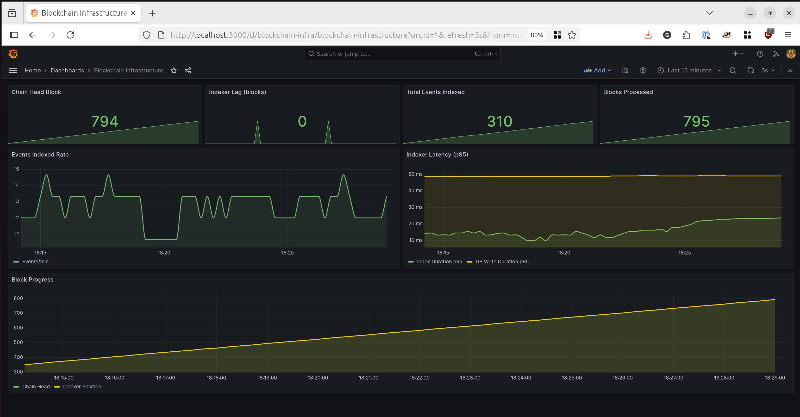

# Blockchain Purchase System

A hands-on learning lab for blockchain infrastructure, data engineering, and operations. This project simulates a small purchase system on a local Ethereum devnet, demonstrating how to build and operate blockchain infrastructure similar to services like Infura, Dune Analytics, and Etherscan.

## Overview

This project teaches:

- **Blockchain Infrastructure**: Running a full node, exposing RPC/WebSocket interfaces, handling transactions
- **Data Engineering**: Building indexing pipelines that treat blockchain events like streaming data
- **SRE/Operations**: Monitoring block height, node health, event throughput, and system reliability
- **FinOps**: Understanding storage, CPU, and network considerations for blockchain nodes

## Architecture

```
+------------------+
|    Simulator     |
|  (Purchases)     |
+--------+---------+
         |
         | sends transactions
         v
+--------+---------+     +------------------+
|      Geth        |     |    Indexer       |
|    (Devnet)      |---->|  (RPC -> PG)     |
|                  |     |                  |
|  RPC: 8545       |     +--------+---------+
|  WS:  8546       |              |
|  Metrics: 6060   |              v
+--------+---------+     +--------+---------+
         |               |   PostgreSQL     |
         |               |                  |
         v               |  - raw_logs      |
+--------+---------+     |  - purchases     |
|   Prometheus     |     +------------------+
|                  |
|  Port: 9090      |
+--------+---------+
         |
         v
+--------+---------+
|    Grafana       |
|                  |
|  Port: 3000      |
+------------------+
```

## Components

| Service | Description | Port |
|---------|-------------|------|
| Geth | Ethereum execution client in dev mode | 8545 (RPC), 8546 (WS), 6060 (metrics) |
| PostgreSQL | Stores raw logs and decoded purchases | 5432 |
| Deployer | One-shot container that deploys the smart contract | - |
| Simulator | Generates random purchase transactions | - |
| Indexer | Polls chain for events, stores in Postgres | 8000 (metrics) |
| Prometheus | Metrics collection and storage | 9090 |
| Grafana | Visualization and dashboards | 3000 |
| Blockscout | Block explorer web UI | 4000 |

## What is Geth?

**Geth (Go Ethereum)** is the official Go implementation of the Ethereum protocol and the most critical component in this stack. It's the software that actually runs an Ethereum node.

### What Geth Does

- **Runs the blockchain node** - Connects to networks, syncs blocks, validates transactions
- **Maintains state** - Stores account balances, smart contract code, and contract storage
- **Provides APIs** - Exposes JSON-RPC and WebSocket endpoints for wallets, dApps, and indexers
- **Executes transactions** - Runs the EVM (Ethereum Virtual Machine) to process smart contract calls

### Dev Mode vs Production

In this project, Geth runs in **dev mode** (`--dev`), which creates a lightweight private chain:

| Dev Mode | Production (Mainnet/Testnet) |
|----------|------------------------------|
| Single node, no network | Thousands of peers |
| Instant block production | 12-second block times |
| Pre-funded test account | Real ETH required |
| Megabytes of storage | 1TB+ for full node |
| No consensus overhead | Requires consensus client |

### Why Geth Matters in Production

If you were running this infrastructure for real, Geth would be your primary operational concern:

- **Sync time**: Full mainnet sync takes days
- **Storage growth**: Blockchain grows ~1GB/day on mainnet
- **Uptime**: If Geth goes down, everything depending on it fails
- **RPC load**: Heavy traffic can overwhelm a single node
- **Client diversity**: Production systems often run multiple client implementations (Geth, Erigon, Nethermind) for resilience

### Other Execution Clients

Geth is not the only option. Alternative Ethereum execution clients include:

- **Erigon** - Optimized for disk space and sync speed
- **Nethermind** - .NET implementation with good performance
- **Besu** - Java implementation, enterprise-focused
- **Reth** - Rust implementation, newer and fast

Since Ethereum moved to proof-of-stake (The Merge, 2022), production nodes also require a **consensus client** (Lighthouse, Prysm, Teku, etc.) paired with the execution client.

## Blockscout - Block Explorer

**Blockscout** is an open-source block explorer that provides a web UI for browsing the blockchain. It's the same software that powers many production block explorers.

### What You Can Do with Blockscout

- **Browse Blocks**: View block details, timestamps, transactions per block
- **View Transactions**: See transaction details, gas used, input data, logs
- **Explore Addresses**: Check balances, transaction history for any wallet
- **Inspect Contracts**: View deployed contract code, read/write functions, events
- **Search**: Find any block, transaction, or address by hash

### Accessing Blockscout

Open http://localhost:4000 in your browser. You'll see:

- Recent blocks on the homepage
- Transaction list with purchase transactions from the simulator
- The deployed PurchaseStore contract (search by address from deployer logs)
- Event logs showing PurchaseMade events

This gives you the same experience as using Etherscan on mainnet, but for your local devnet.


## Quick Start

### Prerequisites

- Docker and Docker Compose v2+
- 4GB+ RAM available for containers

### Start the System

```bash
# Clone and enter the directory
cd eth-infra-and-indexing

# Start all services
./scripts/start.sh

# Or manually:
docker compose up -d --build
```

### Access Services

- **Blockscout Explorer**: http://localhost:4000 (browse blocks, transactions, contracts)
- **Grafana Dashboard**: http://localhost:3000 (admin/admin)
- **Prometheus**: http://localhost:9090
- **Geth RPC**: http://localhost:8545
- **Indexer Metrics**: http://localhost:8000/metrics

### Verify It's Working

```bash
# Check chain is producing blocks
curl -X POST http://localhost:8545 \
  -H "Content-Type: application/json" \
  -d '{"jsonrpc":"2.0","method":"eth_blockNumber","params":[],"id":1}'

# View service logs
docker compose logs -f simulator indexer

# Query purchases from database
./scripts/query.sh "SELECT * FROM get_recent_purchases(5);"
```

### Stop the System

```bash
# Stop all services (preserves data)
./scripts/stop.sh

# Stop and remove all data
./scripts/reset.sh
```

## Smart Contract

The `PurchaseStore` contract emits `PurchaseMade` events when purchases are made:

```solidity
event PurchaseMade(
    address indexed buyer,
    uint256 indexed productId,
    uint256 price,
    uint256 quantity,
    uint256 timestamp
);
```

### Product Catalog

| ID | Product | Price (ETH) |
|----|---------|-------------|
| 1 | Coffee | 0.001 |
| 2 | Sandwich | 0.005 |
| 3 | Pizza | 0.01 |
| 4 | Burger | 0.008 |
| 5 | Salad | 0.006 |

## Database Schema

### Tables

- `raw_logs`: Raw blockchain logs in JSON format
- `purchases`: Decoded purchase events with structured columns
- `products`: Static product reference data

### Analytics Views

```sql
-- Daily sales summary
SELECT * FROM daily_sales;

-- Product performance
SELECT * FROM product_performance;

-- Buyer activity
SELECT * FROM buyer_activity;

-- Hourly activity for time-series
SELECT * FROM hourly_activity;
```

### Example Queries

```sql
-- Recent purchases with product names
SELECT * FROM get_recent_purchases(10);

-- Total revenue by product
SELECT
    pr.name,
    COUNT(*) as purchases,
    SUM(p.price_wei) / 1e18 as total_eth
FROM purchases p
JOIN products pr ON p.product_id = pr.product_id
GROUP BY pr.name
ORDER BY total_eth DESC;

-- Purchases per hour
SELECT
    DATE_TRUNC('hour', event_timestamp) as hour,
    COUNT(*) as tx_count
FROM purchases
GROUP BY 1
ORDER BY 1 DESC
LIMIT 24;
```

## Monitoring

### Grafana Dashboards

The pre-configured dashboard shows:

- Chain head block number
- Indexer lag (blocks behind)
- Total events indexed
- Events indexed per minute
- Indexer latency (p95)
- Block progress timeline



### Prometheus Metrics

Key metrics exposed by the indexer:

| Metric | Description |
|--------|-------------|
| `indexer_events_indexed_total` | Total events indexed |
| `indexer_blocks_processed_total` | Total blocks processed |
| `indexer_current_block` | Current indexer position |
| `indexer_chain_head` | Latest block on chain |
| `indexer_lag_blocks` | Blocks behind chain head |
| `indexer_index_duration_seconds` | Time to index events |
| `indexer_db_write_duration_seconds` | Time to write to database |

### Geth Metrics

Geth exposes metrics at `http://localhost:6060/debug/metrics/prometheus` including:

- Block processing time
- Peer count
- Transaction pool size
- Database operations

## Project Structure

```
.
├── README.md
├── claude.md                 # Project specification
├── docker-compose.yml        # All service definitions
├── contracts/
│   └── PurchaseStore.sol     # Smart contract
├── scripts/
│   ├── Dockerfile.deployer   # Contract deployer image
│   ├── deploy_contract.py    # Deployment script
│   ├── start.sh              # Start all services
│   ├── stop.sh               # Stop all services
│   ├── reset.sh              # Reset all data
│   └── query.sh              # Database query helper
├── services/
│   ├── indexer/
│   │   ├── Dockerfile
│   │   └── indexer.py        # Event indexing service
│   └── simulator/
│       ├── Dockerfile
│       └── simulator.py      # Purchase generator
└── docker/
    ├── postgres/
    │   └── init.sql          # Database schema
    ├── prometheus/
    │   └── prometheus.yml    # Prometheus config
    └── grafana/
        └── provisioning/     # Dashboards and datasources
```

## Data Engineering Parallels

| Data Engineering Concept | Blockchain Equivalent |
|-------------------------|----------------------|
| Kafka topic | Blockchain blocks and transactions |
| Producer sending messages | Wallet submitting transactions |
| Event schema | Smart contract events (logs) |
| ETL/Flink job | Indexer reading logs via RPC |
| Data warehouse | PostgreSQL storing decoded events |
| Metrics/observability | Node metrics + RPC latency |
| BI dashboards | Grafana dashboards |

## Troubleshooting

### Services not starting

```bash
# Check service status
docker compose ps

# View specific service logs
docker compose logs geth
docker compose logs deployer
docker compose logs indexer
```

### Contract deployment fails

The deployer waits for Geth to be healthy. If it fails:

```bash
# Check Geth is running
curl http://localhost:8545

# Restart deployer
docker compose up -d deployer
```

### No events being indexed

```bash
# Check simulator is running
docker compose logs -f simulator

# Check indexer status
docker compose logs -f indexer

# Verify contract was deployed
docker compose logs deployer
```

### Database connection issues

```bash
# Check Postgres is running
docker compose exec postgres pg_isready -U indexer

# Connect manually
docker compose exec postgres psql -U indexer -d blockchain_data
```

### Permission denied errors

If Prometheus or Grafana fail with permission errors on config files:

```bash
# Fix permissions on config files
chmod -R a+r docker/
find docker/ -type d -exec chmod a+x {} \;

# Restart affected services
docker compose restart prometheus grafana
```

## Learning Objectives

After completing this project, you will understand:

1. How to run and manage an Ethereum client locally
2. RPC endpoints and WebSocket subscriptions
3. Block production, state, and logs
4. Mapping blockchain logs to structured data
5. Building indexing pipelines
6. Monitoring blockchain infrastructure
7. Storage and compute considerations for nodes

## Next Steps

- Add a block explorer (Blockscout) for visual transaction browsing
- Implement WebSocket subscriptions for real-time event streaming
- Add more complex analytics with dbt or similar tools
- Deploy to a testnet (Sepolia, Holesky)
- Document production deployment considerations (AWS, GCP)

## Requirements

- Docker Engine 20.10+
- Docker Compose v2.0+
- 4GB RAM minimum
- 10GB disk space

## License

MIT
